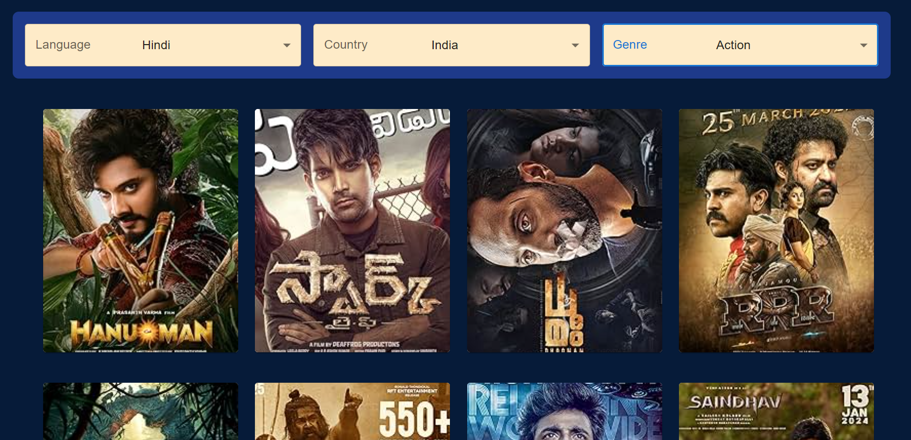
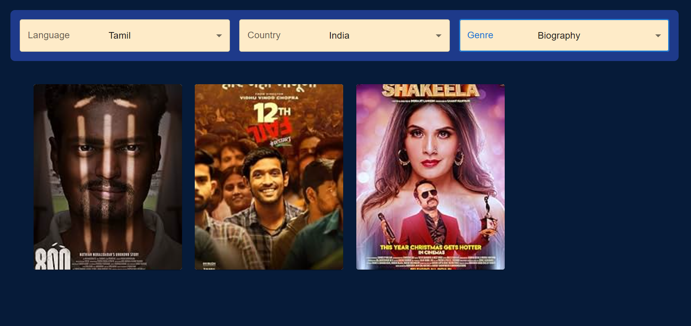
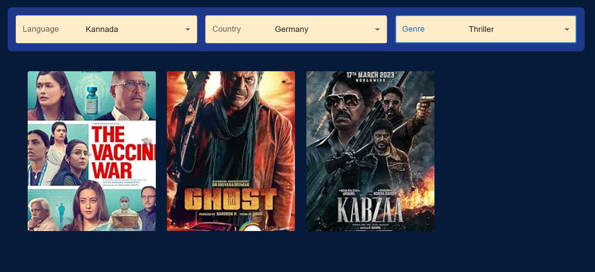

# movieSpot

## Description
movieSpot is a React application developed using Vite, a fast build tool for modern web development. It allows users to explore a curated collection of movies with features such as filtering by language, country, and genre.

## Features
- Browse a diverse selection of movies.
- Filter movies by language, country, and genre.
- Responsive design for seamless viewing on different devices.
- Detailed information and images for each movie.

## Getting Started
To run the application locally, follow these steps:
1. Clone this repository to your local machine.
2. Navigate to the project directory in your terminal.
3. Install dependencies by running the command: npm install
4. Start the development server by running the command: npm run dev
5. Once the server is running, open your web browser and navigate to http://localhost.

## Usage
- Use the dropdown menus to filter movies by language, country, and genre.
- Scroll through the list of movies and click on a movie to view more details.
- Explore different categories to discover new movies.

### Screenshots

#### Home 

#### Movie Details 

### Filter Applied

#### Filter Settings - 1:
- **Language:** Hindi
- **Country:** India
- **Genre:** Action

#### Filter Settings - 2:
- **Language:** Tamil
- **Country:** India
- **Genre:** Biography

#### Filter Settings - 3:
- **Language:** Kannada
- **Country:** Germany
- **Genre:** Thriller

## Dependencies

- React.js (^18.2.0)
- Vite
- Tailwind CSS

Additional Libraries:
- @emotion/react (^11.11.4)
- @emotion/styled (^11.11.5)
- @mui/material (^5.15.15)

## Contributors
- [Priyanka Pandharbale](https://github.com/priyankap0101)

## License
This project is licensed under the MIT License. See the [LICENSE](LICENSE) file for details.

## Support
If you encounter any issues or have questions about Movie Explorer, please [open an issue](https://github.com/priyankap0101/movie-spot/issues) on GitHub.

